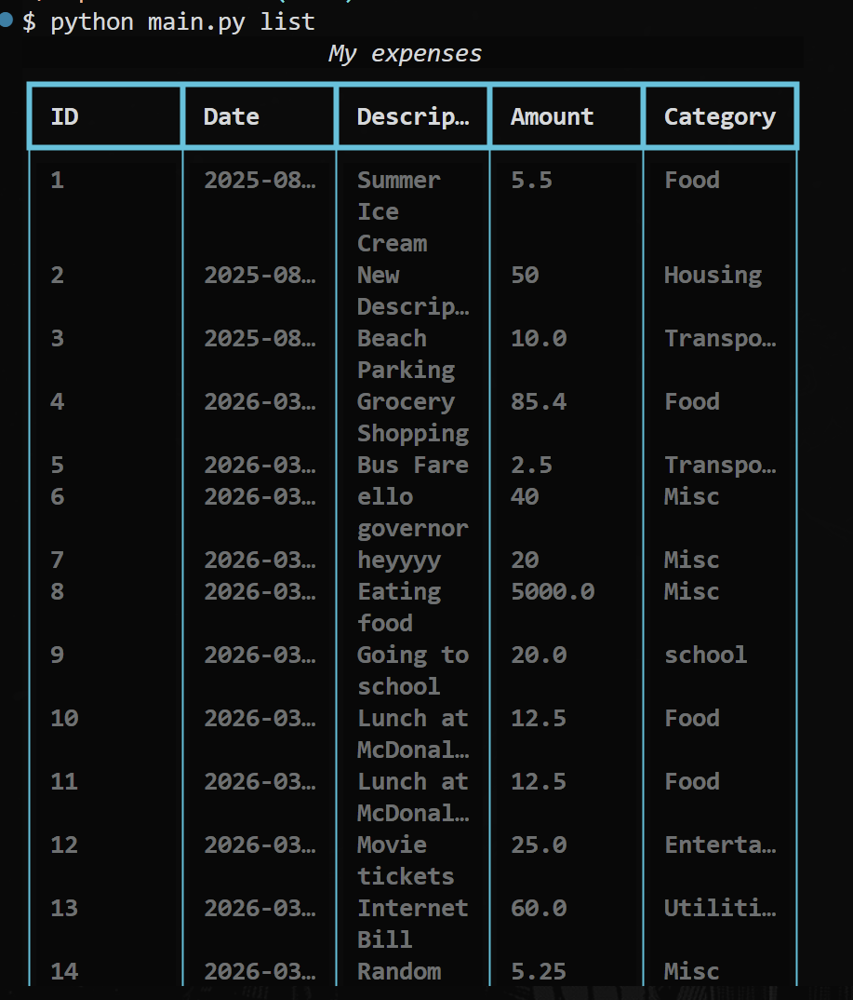

# Expense Tracker CLI

A simple tool to manage your finances from the command line. You can keep track of what you spend, see summaries, and check your monthly totals.

Project idea from [roadmap.sh](https://roadmap.sh/projects/expense-tracker)

## Screenshot don't forget to add this later



## Project Structure:

```
expense-tracker/
├── main.py          # CLI entry point, handles commands and arguments.
├── expenses.py      # Expense model, defines what an expense looks like.
├── utils.py         # The brains of the app, handles logic and data storage.
├── expenses.json    # Where your data is actually saved.
└── README.md        # Project documentation
```

## Installation

make sure you have python 3 installed.

```bash
git clone https://github.com/LU347/expense-tracker.git
cd expense-tracker
```

## How to use it

here are the main commands you can use:

### 1. add an expense

```bash
python main.py add --description "Lunch" --amount 20
```

### 2. see your list

```bash
python main.py list
```

### 3. view a summary

```bash
python main.py summary # shows total of everything
python main.py summary --month 8 # shows total for a specific month
```

### 4. delete an expense

```bash
python main.py delete --id 1
```

---

This project was built to practice building CLI apps and handling JSON data for storage.
