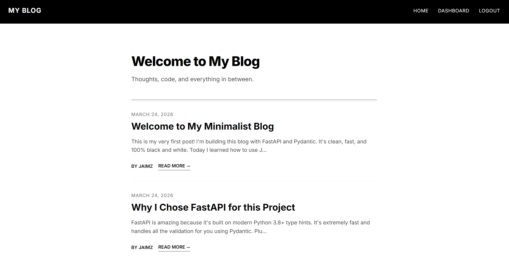
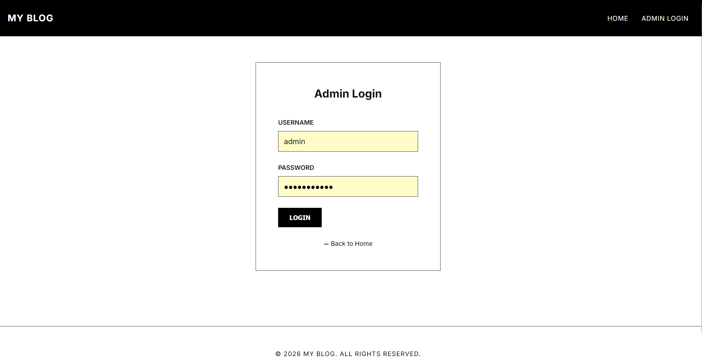
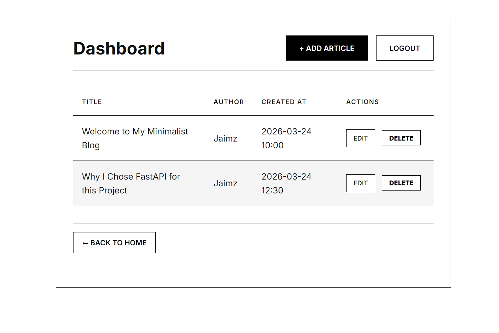
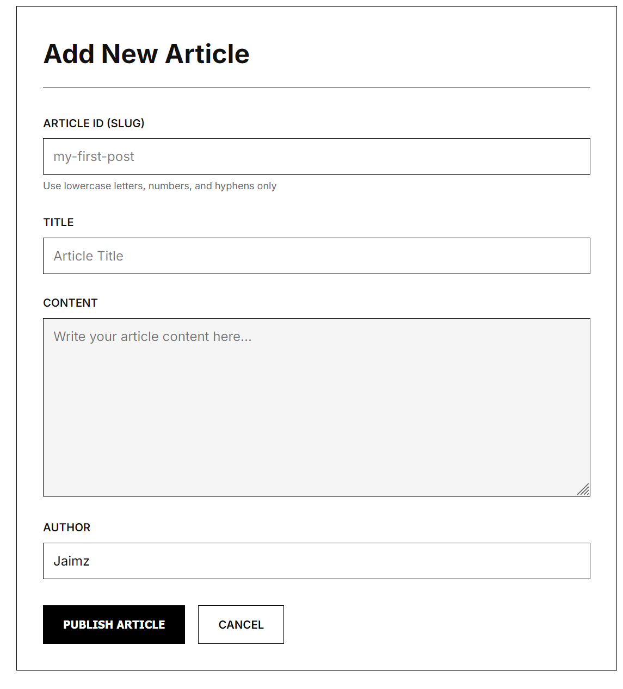

# Personal Blog

A full-stack personal blogging platform built with FastAPI, Jinja2, and a custom minimalist design, inspired by [roadmap.sh](https://roadmap.sh).

## Screenshots





## Features

- **Admin Dashboard**: Full CRUD (Create, Read, Update, Delete) capability for blog articles.
- **Authentication**: Secure login with session-based middleware.
- **Minimalist UI**: Clean, black-and-white interface using custom CSS and the Inter font.
- **JSON Storage**: Lightweight and portable lightweight storage system for articles.

## Built With

- **Backend**: FastAPI (Python)
- **Frontend**: HTML5, CSS3, Jinja2 Templating Engine
- **Server**: Uvicorn

## Getting Started

To get a local copy up and running, follow these steps:

### Prerequisites

Ensure you have Python 3.8+ installed on your system.

### Installation

1. Navigate to the project directory:

```bash
cd personal-blog
```

2. (Optional) Create and activate a virtual environment:

```bash
python -m venv venv
venv\Scripts\activate  # On Windows
# source venv/bin/activate  # On macOS/Linux
```

3. Install the required dependencies:

```bash
pip install -r requirements.txt
```

4. Start the FastAPI application:

```bash
uvicorn main:app --reload
```

5. Open your browser and navigate to `http://localhost:8000`. 
   To manage your blog, navigate to the dashboard by clicking "Admin Login" or visiting `http://localhost:8000/login`.

## License

MIT
