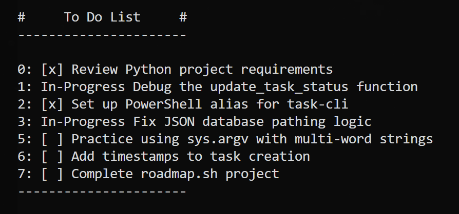

# Task Tracker CLI

A simple tool to manage tasks from the command line. it's built to act like a real app with a backend and a database (it just uses a json file for that).

Project idea from [roadmap.sh](https://roadmap.sh/projects/task-tracker)

## Screenshot



## Project Structure:

```
task-tracker-cli/
├── main.py        # CLI entry point, acts as the client, where you actually type the commands.
├── api.py         # Simulates server, handles all the logic and processing.
├── task.py        # Task model definition, defines what each Task should look like
├── tasks.json     # Data storage (JSON database)
└── README.md      # Project documentation
```

## Installation

make sure you have python 3 installed.

```bash
git clone https://github.com/LU347/task-tracker-cli.git
cd task-tracker-cli
```

if you're on linux or mac you might need to run `chmod +x main.py` too.

## How to use it

here's the stuff you can do:

### 1. add a task

```bash
python main.py add "finish this readme"
```

### 2. update a task

```bash
python main.py update 0 "new task name" # {id} {new name}
```

### 3. mark as done / in-progress

```bash
python main.py mark 0 done
python main.py mark 0 in-progress
```

### 4. see your list

```bash
python main.py list # shows all of them
python main.py list done # or filter by status
```

### 5. delete something

```bash
python main.py delete 0
```

---

This project was made for learning, and made me realize i know nothing...I've still got a long way to go